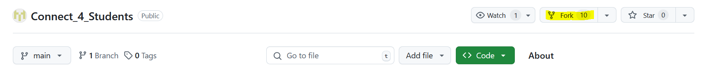
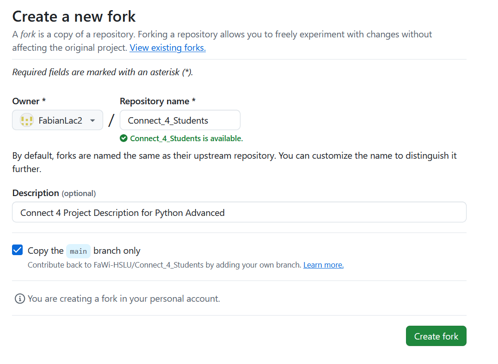

# Anleitung: Repository korrekt forken und verwenden

Willkommen! Diese Anleitung erklärt, wie du dieses Repository als Basis für dein eigenes Projekt verwenden kannst. Statt Änderungen direkt an diesem Repository vorzuschlagen (via Pull Request), solltest du das Repository **forken** und in deinem eigenen Repository arbeiten.

---

## 🚀 Schritte zum Forken und Arbeiten

### 1. Erstelle einen Fork
Ein Fork ist eine Kopie dieses Repositories in deinem eigenen GitHub-Account. Folge diesen Schritten:

1. Klicke oben rechts in diesem Repository auf den **Fork**-Button.



2. Wähle **deinen eigenen GitHub-Account** als Ziel aus. (In meinem Beispiel `FabianLac2`)



3. GitHub erstellt jetzt eine Kopie dieses Repositories in **deinem Account.** 

---

### 2. Klone deinen Fork
Nachdem du das Repository geforkt hast, **klone deinen Fork** (nicht dieses Original-Repo!) auf deinen lokalen Rechner:

Verwende hierzu **VS Code.**

Eine Anleitung zum vorbereiten von VS Code findest du hier: [Anleitung GitHub & VS Code](https://code.visualstudio.com/docs/sourcecontrol/github)

Wenn du `GitHub Pull Requests` installiert und dich auf GitHub angemeldet hast, kannst du nun **dein Repo klonen.** 


Um nun die Verbindung zum ursprünglichen Repository zu entfernen (Dozenten Repo) führe dies in der Command Line aus: 

```bash
    git remote remove upstream
```
Jetzt ist dein Fork eine **unabhängige Kopie,** die keine Verbindung mehr zum Original hat.

