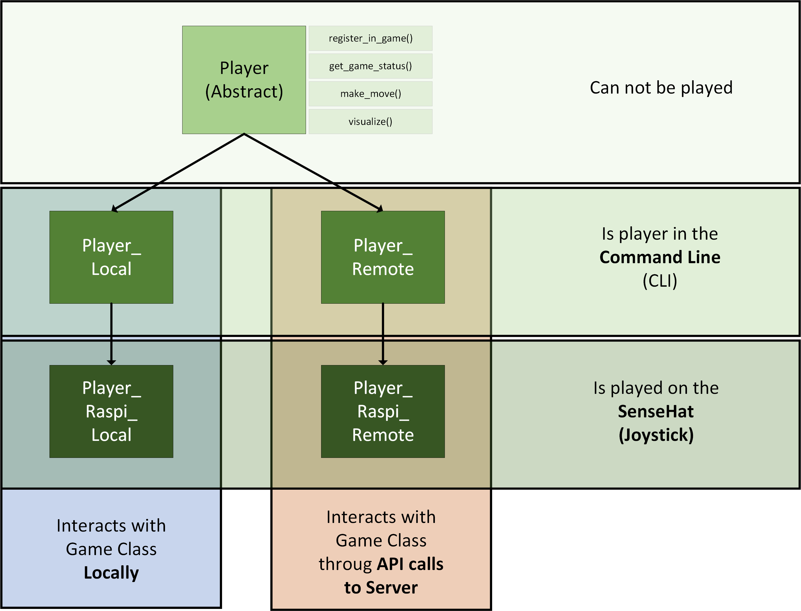
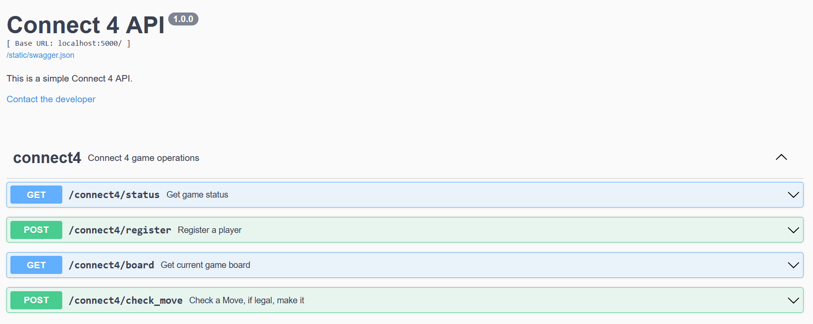

# Raspi Connect 4
Student Project from **Python Advanced**, HS24


## Game Architecture
There are **Connect 4 Game** can be played in 4 different ways:
- locally (2 players) on `CLI`
- locally (2 players) on `SenseHat`
- remote (2x 1 Player) on `CLI`
- remote (2x 1 Player) on `SenseHat`




These different game versions are mainly separated through **different `Player` classes** which all implement certain **abstrac methods** in **different ways**. The main abstract methods are:
- `make_move`: Allows the user to select a column where to drop a coin
- `visualize`:  Visualized Board state to User
- `register_in_game`: Registers the Player in a given game
- `get_game_status`:  Gets the current status of the game

<div style="text-align: center;">

</div>

## Classes
The complete game contains the following classes:

- `Connect4`: Contains **Game Logic**
  - Details in [Game](#connect4---game)
- ``Server``: Exposes Methods from `Connect4` (for Remote Players)
  - Details in [Servers](#server)
- `Player`: Abstract Class (describes what a player should be able to do) 
  - `Player_Local`: Player using methods from locally available `Connect4` object.
    - `Player_Raspi_Local`: Local Player on a RaspberryPi (using the `SenseHat`)
    - Details in [Local Player](#local-player)
  - `Player_Remote`: Player using **REST - API - Endpoints** for `Connect4` interaction through `Server`
    - `Player_Raspi_Remote`: Remote Player on a RaspberryPi (using the `SenseHat`)
    - Details in [Remote Player](#remote-player)
  
- `Coordinator_Local`: Coordinates **2 Local Players** (on same device)
  - Details in [Local Interaction](#local-interactions)
- `Coordinator_Remote`: Coordinates **1 Player local player** (same device) with **1 remote player**(different device) by communicating with the ``server``.
  - Details in [Remote Interaction](#remote-interaction)


### Connect4 - Game
This class contains the essential game logic.
It defines the **game state**(`get_game_state()`):
- **what** an **allowed move** is
- **when** a player **wins** (`winner`)
- **who** s **turn** it is (`active_player`)
- **what** **turn** it is (`turn_number`)

Furthermore it can return the current **board state** (`get_board()`). It then returns an `8x7 numpy array` containing:
  - `'X'` for one player
  - `'O'` for the other player
  - `''` for the empty spots


### Server

The ``Connect4_Server`` - Server offers **four API - Endpoints:** and **exposes** the main methods (described in [Game](#connect4---game), from the `Connect4` Class.)

They are described within a **swagger - documentation** accessible under [http://127.0.0.1:5000/swagger/connect4/](http://127.0.0.1:5000/swagger/connect4/) once the **server is running.**



### Remote Player
The remote players use the **running API - Endpoints** to send and receive information from the ``Connect4`` class.

### Local Player
The local players use an available **instance** of **the same `Connect4` class**, to send and receive information to the same game.

### Local Interactions
If played locally (2 players on same device), the interaction between the classes is as follows:


<div style="text-align: center;">

</div>


**Note**: The ``players`` can either be controlled through the `CLI`, or the `SenseHat` (on Raspi).

### Remote Interaction
If you play remotely (2 players on 2 devices),
the interaction between the classes is as follows:

<div style="text-align: center;">

</div>


**Note**: Here the ``players`` can also either be controlled through the `CLI`, or the `SenseHat` (on Raspi).


## Play the Game

Make sure you fulfill the [Requirements](#requirements)
Then do the try to either run a [local](#local) or [remote](#remote) Game:

### Local Game

1. Start a `local_coordinator.py` in a **terminal**
   - Creates **2 Local Players**
     - Either ``CLI`` or `SenseHat` Players (default is `CLI`)

### Remote Game
1. Start the `server.py` in a **first terminal**
   - Note the `ip-address` of the `server`
2. Start a `remote_coordinator.py` in a **second terminal**
    - Give it the `ip-address` of the `server` as target
    - Play **Player 1** in the `CLI` or on the `SenseHat` (default is `CLI`)
3. Start a `remote_coordinator.py` in a **third terminal**
   - Give it the `ip-address` of the `server` as target
   - Play **Player 2** in the `CLI` or on the `SenseHat` (default is `CLI`)


## Requirements
To fullfil all requirements to run this game to the following:
1. Create a new `conda` or `venv` **environment** and **activate** it.
2. `cd` into this folder
3. Execute the following command

```
pip install .
```

This **installs all Dependencies** listed in `setup.py`

4. Play the Game in any of the [available versions](#game-architecture)


# RaspberryPi
The Raspi needs a quick **Fix**, to allow files to be moved, changed, etc.

1. Be in Folder ``home/pi``

2. **Change the permissions** of the `student` folder (and all ``sub-folders``) with:
```
sudo chmod -R 777 student
```